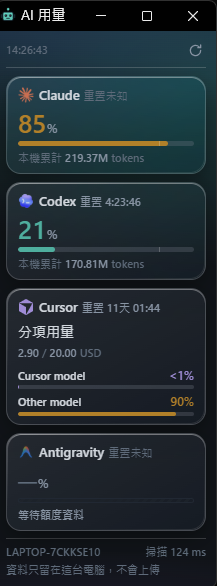

# aiusage

把 **Claude、Codex、Cursor、Antigravity** 的用量集中在一個本機小面板上，
一眼看到各家還剩多少額度、多久之後重置。

單一執行檔，雙擊就跑。不需要安裝執行環境、不需要資料庫、不需要註冊任何服務。
**所有資料都留在這台電腦，不會上傳。**

## 畫面預覽



---

## 下載

最新版本 **v0.2.0**。認不得自己的機器是哪一種就看下面的對照表。

| 作業系統 | 下載 |
| --- | --- |
| Windows（Intel / AMD） | [aiusage-v0.2.0-windows-amd64.tar.gz](https://github.com/mayes-art/ai-usage/releases/download/v0.2.0/aiusage-v0.2.0-windows-amd64.tar.gz) |
| Windows（ARM，如 Surface Pro X） | [aiusage-v0.2.0-windows-arm64.tar.gz](https://github.com/mayes-art/ai-usage/releases/download/v0.2.0/aiusage-v0.2.0-windows-arm64.tar.gz) |
| macOS（Apple Silicon，M1 以後） | [aiusage-v0.2.0-darwin-arm64.tar.gz](https://github.com/mayes-art/ai-usage/releases/download/v0.2.0/aiusage-v0.2.0-darwin-arm64.tar.gz) |
| macOS（Intel） | [aiusage-v0.2.0-darwin-amd64.tar.gz](https://github.com/mayes-art/ai-usage/releases/download/v0.2.0/aiusage-v0.2.0-darwin-amd64.tar.gz) |
| Linux（x64） | [aiusage-v0.2.0-linux-amd64.tar.gz](https://github.com/mayes-art/ai-usage/releases/download/v0.2.0/aiusage-v0.2.0-linux-amd64.tar.gz) |
| Linux（ARM64） | [aiusage-v0.2.0-linux-arm64.tar.gz](https://github.com/mayes-art/ai-usage/releases/download/v0.2.0/aiusage-v0.2.0-linux-arm64.tar.gz) |

其他版本與校驗碼在[發行頁](https://github.com/mayes-art/ai-usage/releases/latest)。
`SHA256SUMS` 對應壓縮檔，`BINARY-SHA256SUMS` 對應解開後的執行檔。

---

## 各系統怎麼用

壓縮檔解開後會得到一個以平台命名的資料夾，執行檔就在裡面。

### Windows

解開後的 `windows-amd64\` 裡有兩個執行檔：

| 執行檔 | 用途 |
| --- | --- |
| `aiusage-panel.exe` | **一般使用者用這個。** 雙擊就開面板，沒有黑色主控台視窗 |
| `aiusage.exe` | 終端機版，用來跑 `report`、`doctor` 這類指令 |

功能最完整的就是 Windows：面板會**固定在最上層**、平常半透明、滑鼠移過去才變清楚，
可以從面板任何空白處按住拖到你想要的位置。

開機就自動啟動：按 `Win`+`R` 輸入 `shell:startup`，把 `aiusage-panel.exe` 的捷徑丟進去。

### macOS

解開後只有一個 `aiusage` 執行檔。第一次先給它執行權限：

```sh
chmod +x ./darwin-arm64/aiusage
./darwin-arm64/aiusage
```

**產物沒有簽章也沒有經過 Apple 公證**，所以第一次開啟時系統會擋下來。
到「系統設定 → 隱私權與安全性」找到被封鎖的提示，按「仍要開啟」。
請自行評估來源可信度再決定。

面板會用 Edge 或 Chrome 的 app 模式開啟，沒有的話就用預設瀏覽器。
**置頂、半透明與拖曳這些視窗整合目前只有 Windows 有**，macOS 上就是一個一般視窗。

### Linux

```sh
chmod +x ./linux-amd64/aiusage
./linux-amd64/aiusage
```

面板用 `xdg-open` 交給預設瀏覽器開啟。同樣沒有視窗整合。

---

## 各家來源支援到什麼程度

| 來源 | 讀得到什麼 | 需要什麼條件 |
| --- | --- | --- |
| **Claude** | Code 紀錄、Desktop 額度快照，以及選配的 CLI statusLine 額度 | Desktop 要開過用量頁面才會產生新快照。**重置倒數只有 statusLine 那條路帶得回來** |
| **Codex** | 透過已安裝的 `codex app-server` 查帳號額度，失敗時用 session 紀錄備援 | 要已登入、而且 `codex` 在 `PATH` 找得到 |
| **Cursor** | 沿用既有登入，向 Cursor 的用量介面查個人方案額度 | 優先讀 IDE 登入，其次 CLI。**IDE 登入讀取只有 Windows 支援** |
| **Antigravity** | 從執行中的本機服務讀各模型群額度 | 必須開著並已登入。**服務自動偵測只有 Windows 支援** |

沒有帳號額度可讀的來源，可以自己填上限，面板就會用本機統計的用量去算百分比。

---

## 面板上有什麼

面板是一條窄長的直條，每個 AI 工具一張卡片，由上往下排。

一張卡片上會看到：

- **工具圖示與名稱**
- **重置倒數** —— 例如 `重置 0:55:12`，每秒往下跳。來源沒提供重置時間就顯示「重置未知」，
  這是誠實的「不知道」，不是零
- **一個大百分比** —— 這張卡最重要的數字，就是已經用掉多少
- **進度條** —— 條上那道細線是警戒線，預設 80%
- **用量** —— 例如 `1.24M / 3.50M tokens` 或 `US$2.90 / US$20.00`

Cursor 的卡片會多出 **Cursor model** 與 **Other model** 兩條，因為它們是各自獨立的額度池，
不能相加也不能平均。

**在卡片上按一下左鍵**就會展開詳細資訊：計量視窗、剩餘比例、其他限制（例如 Codex 的 7 天窗）、
額度是什麼時候取得的、讀取錯誤，以及手動設定上限的表單。再按一下收合。
展開中的卡片會亮起來。

顏色會隨用量變：正常是該工具的代表色，超過警戒線轉黃，用滿轉紅。

面板右上角只有一顆**重新掃描**按鈕，會清掉讀取位置重新掃一次所有紀錄，
也能讓額度查詢立刻重試。

### 幾個容易誤讀的地方

- **帳號額度百分比和本機 token 統計是兩回事。** 「本機累計」只是我們讀得到的紀錄，
  不能拿來反推帳號的總額度。
- **沒有資料就顯示 `—%`**，那不等於「已使用 0%」。
- **「最舊紀錄滑出」不是帳號重置。** 那只是一筆本機紀錄即將離開統計範圍。
- **「更新於」是畫面的時間**，不代表每個來源都剛剛查過。

---

## 終端機指令

Windows 用 `aiusage.exe`，macOS / Linux 用 `aiusage`。

```sh
aiusage                    # 開面板（不加參數就是這個）
aiusage report             # 掃描一次，把目前用量印出來
aiusage doctor             # 檢查來源、路徑與讀取錯誤
aiusage config             # 印出設定檔位置
aiusage version
```

面板可加的參數：

| 參數 | 說明 |
| --- | --- |
| `-port N` | 指定本機埠，`0` 為自動挑選 |
| `-interval N` | 掃描間隔秒數 |
| `-no-browser` | 不自動開視窗，只讓服務在背景跑 |

---

## 讓 Claude 顯示重置倒數

Claude Desktop 的額度快照裡**只有百分比，沒有重置時間**，所以預設會顯示「重置未知」。

想要倒數的話，把 Claude CLI 的 statusLine 接到 aiusage。在 `.claude/settings.json` 加入：

```json
{"statusLine":{"type":"command","command":"C:/你的路徑/aiusage.exe claude-statusline"}}
```

之後 Claude Code 每次更新狀態列，就會把額度資料交給 aiusage，倒數就會出現。
狀態列也會順便顯示 `Claude 42%` 這樣的用量。

已經有自訂 statusLine 的話要整合進去，不要直接蓋掉。
細節見 [Claude 來源說明](docs/providers/claude.md)。

---

## 讀不到資料怎麼辦

先按面板上的**重新掃描**，或跑 `aiusage doctor` 看它讀到哪些路徑、卡在哪裡。

常見情況：

- **Claude 沒有額度** —— 開一次 Claude Desktop 的用量頁面，或設定上面的 statusLine
- **Codex 沒有額度** —— 確認 `codex` 在 `PATH` 裡而且已經登入
- **Cursor 沒有額度** —— 確認 IDE 或 CLI 是登入狀態；非 Windows 請用 CLI 登入
- **Antigravity 沒有額度** —— 它必須開著並登入；而且服務自動偵測只有 Windows 有
- **面板沒開起來** —— 從主控台或 `panel.log` 取得網址，自己貼到瀏覽器

---

## 隱私

- 服務只綁在 `127.0.0.1`，不對外開放，也不會把任何資料送出這台電腦。
- 頁面與資料介面需要啟動時產生的一次性 token 才能存取，避免本機其他網頁順手打這個埠。
- 只讀取用量所需的欄位。**不讀對話內容，不儲存登入 token。**
- Cursor 的登入資訊只由專用的唯讀讀取器使用。
- `panel.url` 與 `panel.log` 可能含有能開啟面板的網址，分享診斷資料時請避開這兩個檔案。

---

## 進一步

- [開發技術細節](docs/development.md) —— 建置、發行、設定檔欄位、計量規則、資料邊界
- [架構說明](docs/architecture.md) —— 分層與擴充契約
- 來源細節：[Claude](docs/providers/claude.md)、[Cursor](docs/providers/cursor.md)、[Antigravity](docs/providers/antigravity.md)

## 授權

[MIT License](LICENSE)
