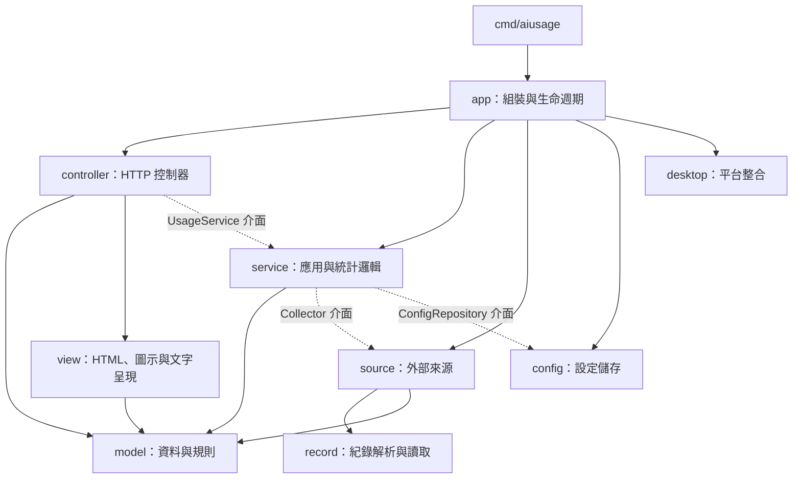

# 架構與擴充方式

專案採單一 Go module，使用 `cmd` 放置執行入口、`internal` 封裝不對外提供的套件，
參考 [Go 官方模組組織指南](https://go.dev/doc/modules/layout)。MVC 用來區分輸入控制、
用量模型與顯示責任，另外以應用服務和來源介面隔開外部系統。

## 目錄

```text
cmd/aiusage/                  執行入口
internal/
  app/                        指令解析、服務組裝與程式生命週期
  model/                      設定、事件、額度、快照與來源政策
  service/                    收集協調、去重、累計增量、統計視窗與設定更新
  source/
    logs/                     本機紀錄收集與欄位診斷
    codex/                    Codex app-server 與紀錄備援
    claude/                   Claude Desktop / statusLine 額度
    cursor/                   Cursor 帳號用量與登入來源
    antigravity/              Antigravity 本機服務
  record/                     JSON / JSONL 讀取及事件、額度解析
  config/                     JSON 設定儲存、預設值、遷移與路徑
  controller/                 HTTP 請求、資料 API 與面板連線生命週期
  view/                       內嵌 HTML、圖示與終端報表
  desktop/                    各平台的程序、視窗、瀏覽器與安裝偵測
  buildinfo/                  應用程式版本
  architecture/               套件依賴方向的測試
docs/providers/               各來源的操作與相容性說明
scripts/release.sh            Docker 內的測試與跨平台建置流程
```

## MVC 與依賴方向



實線表示主要的編譯期依賴，虛線表示執行時注入的介面；不是完整的 import 清單。

- **Model**：`model` 定義資料與基本規則，`service` 執行去重、累計增量、視窗統計、
  額度優先權與設定更新。兩者都不依賴 HTTP、具體供應商或檔案設定實作。
- **View**：只負責顯示。HTTP 頁面與圖示以 `go:embed` 包進執行檔，終端輸出接受
  `io.Writer`，可直接測試。瀏覽器內的互動保留既有 API 協定。
- **Controller**：驗證及處理 HTTP 請求、呼叫 `UsageService`、輸出快照與管理 SSE。
  CLI 輸入由 `app` 處理，`cmd/aiusage/main.go` 只將標準輸入輸出交給 `app.Run`。
- **組裝**：`app` 建立來源、設定儲存與平台整合，再注入服務與控制器。

## SOLID 的實際做法

| 原則 | 實作方式 |
| --- | --- |
| 單一職責 | 來源負責 IO 與快取；service 負責統計；controller 負責請求；view 負責呈現 |
| 開放封閉 | `Collector` registry 注入來源；`ProviderPolicy` 提供顯示與計量特性，service 不以供應商 ID 切換實作 |
| 里氏替換 | 所有 Collector 遵守相同的增量事件、快照與重設契約；測試可用替代來源執行完整服務流程 |
| 介面隔離 | `UsageService`、`Collector`、`ConfigRepository` 由使用端定義，只暴露該端所需的操作 |
| 依賴反轉 | service 接收收集與儲存介面；controller 接收服務介面；具體依賴由 app 組裝 |

不為每個 struct 建立空泛的介面；資料值、解析函式與平台實作仍使用一般 Go 型別與函式。
`internal/architecture` 以 AST 檢查正式程式的 import，防止 Model、Service、Controller、
View 反向依賴具體來源或組裝層。

## 來源契約與並行

`service.Collector` 定義 `Collect(provider, cutoff, collectKeys)` 與 `Reset()`。

1. `Collect` 只交付本輪新讀取的事件；quota 與診斷可回傳快取。回傳後不可再原地修改該批資料。
2. 來源負責檔案位移、登入／服務存取、查詢間隔與失敗備援。service 負責事件去重、
   累計換算、保留期及跨時間視窗的統計。
3. Store 會序列化 `Collect` / `Reset`；HTTP 快照可以同時讀取。
4. 選配的 `Policy()` 可與收集並行，必須只回傳不可變的來源描述與政策。
5. 設定以深拷貝交付；更新先儲存成功才替換目前設定，寫入失敗時保留原設定。

新增來源時，實作一個 `internal/source/<name>` 套件，提供 Collector，並在 `app` registry
註冊。若要預設啟用或加入安裝偵測，再更新 config 預設值與 desktop 安裝規則；
不需在 service 加入新供應商的分支。新增特有 UI 操作時，才另行擴充 view/controller。

## 驗證與平台界線

`scripts/release.sh` 先執行全專案競態測試與靜態檢查，再使用 `CGO_ENABLED=0`
建置六個平台／架構組合；Windows 另產出 GUI 子系統版本。

- 測試使用暫存檔、假來源與 HTTP 測試服務，不需要個人帳號或對話紀錄。
- 已納入 token 分項、累計去重、大型 JSON、快取重試、設定寫入失敗、MVC 依賴方向、
  API 與面板視窗關閉的驗證。
- 跨平台編譯不等同於各作業系統的實機驗證。Antigravity 自動偵測及 Cursor IDE 登入讀取
  仍僅支援 Windows；其他平台的 Cursor 可使用 CLI 登入。
- 產物是獨立執行檔，未包含 macOS `.app`、簽章或 Apple 公證，也未提供安裝程式。

目前仍有兩項既有資料邊界需要注意：缺少 session ID 的累計紀錄可能共用同一累計鍵；
同一秒內被改寫且大小不變的紀錄檔可能未被辨識為更新。它們與本次分層無關，仍需後續
依實際紀錄格式建立案例處理。
